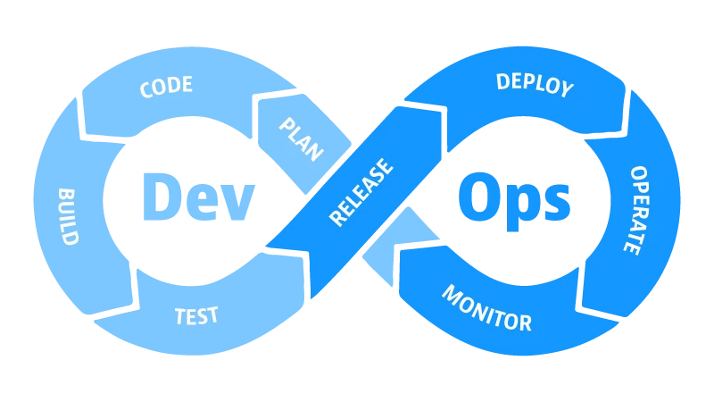

<!-- Slide 1: Title Slide -->

# **DevOps & Automation**

### Transforming Modern Software Development

---

<!-- Slide 2: Introduction -->

## Introduction

- **Context**: Modern software development cycles are fast-paced, requiring rapid and reliable deliveries.
- **DevOps**: A cultural and technical movement uniting development and operations to shorten delivery cycles and provide continuous value.
- **Objective**: Highlight key DevOps principles and the power of automation in boosting efficiency, reliability, and scalability.

---

<!-- Slide 3: DevOps Principles -->

## DevOps Principles

### Culture of Collaboration

- Breaks down silos between Dev, Ops, and QA.
- Shared ownership of quality, security, and uptime.

### Continuous Integration & Delivery (CI/CD)

- Automated build, test, and deployment pipelines.
- Frequent, small releases for rapid feedback and reduced risk.

---

<!-- Slide 4: More DevOps Principles -->

## DevOps Principles (Continued)

### Infrastructure as Code (IaC)

- Manage infrastructure with version-controlled tools (e.g., Terraform, Ansible).
- Ensures consistency and eliminates environment drift.

### Monitoring & Feedback

- Automated monitoring and alerts catch issues early.
- Real-time data drives continuous improvements in performance and security.

---

<!-- Slide 5: Role of Automation -->

## Role of Automation in DevOps

- **Streamlined Processes**

  - Automated testing (Selenium, JUnit)
  - CI/CD (Jenkins, GitLab CI)
  - Configuration management (Chef, Puppet)

- **Reliability & Scalability**

  - Reduced human error through automated provisioning
  - Seamless resource scaling

- **Cost & Time Efficiency**
  - Less manual intervention, faster releases
  - Quick rollbacks for error recovery
  

---

<!-- Slide 6: Manual vs. Automated Comparison -->

## Manual vs. Automated System Administration

| **Aspect**                 | **Manual Tasks**                                        | **Automated Tasks**                                                      |
| -------------------------- | ------------------------------------------------------- | ------------------------------------------------------------------------ |
| **Efficiency**             | Repetitive, slow, error-prone                           | Scripts handle tasks quickly and consistently                            |
| **Reliability**            | Human-dependent; prone to inconsistencies               | Automated workflows ensure uniform, predictable execution                |
| **Scalability**            | Scaling requires significant manual intervention        | Automated resource provisioning on demand                                |
| **Maintenance & Overhead** | Frequent manual checks and updates                      | Centralized scripts, version-controlled for easy updates                 |
| **Learning Curve**         | Straightforward but time-consuming in complex scenarios | Requires learning automation tools but yields long-term efficiency gains |

---

<!-- Slide 7: Summary & Key Takeaways -->

## Summary & Key Takeaways

- **DevOps** integrates cultural shifts and specialized tooling to improve collaboration and software delivery.
- **Automation** is essential for reliability, speed, and scalability.
- **CI/CD, IaC, and Monitoring** are pillars of modern software engineering practices.
- **Outcome**: Faster releases, reduced risk, and a continuous flow of innovation.

---

<!-- Slide 9: Review & Feedback -->

## Review & Feedback

- **Accuracy & Coherence**

  - Validate content correctness and logical flow.

- **Clarity & Design**

  - Check color contrast and text legibility.
  - Collect feedback from peers or instructors.

- **Final Adjustments**
  - Refine text, visuals, and layout.
  - Preview final deck in Marp to ensure consistency.

---

# Thank You

**Thank you for your time and attention!**

---

<!-- Slide 10: References (APA) -->

## References

1. Humble, J., & Farley, D. (2010). _Continuous Delivery: Reliable Software Releases through Build, Test, and Deployment Automation._ Addison-Wesley.
2. Kim, G., Humble, J., Debois, P., & Willis, J. (2016). _The DevOps Handbook: How to Create World-Class Agility, Reliability, and Security in Technology Organizations._ IT Revolution Press.
3. Docker. (n.d.). _Docker Documentation._ [https://docs.docker.com/](https://docs.docker.com/)
4. HashiCorp. (n.d.). _Terraform Documentation._ [https://developer.hashicorp.com/terraform/docs](https://developer.hashicorp.com/terraform/docs)

<!-- End of Presentation -->
